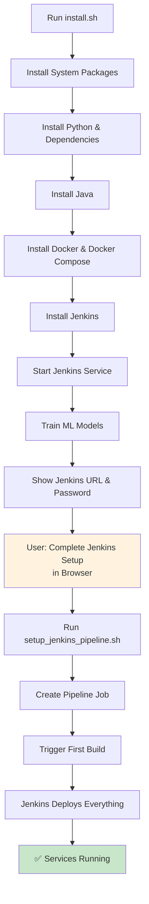

# Jenkins Automation - Complete ✅

## What Changed

The MLOps pipeline now uses **Jenkins for automated deployment** instead of manual docker-compose commands.

## 🎯 New Workflow

### Before (Manual)
```bash
./install.sh          # Install dependencies
./run_demo.sh         # Start services manually
docker-compose up -d  # Manual deployment
```

### After (Automated with Jenkins)
```bash
sudo ./install.sh                    # Install everything including Jenkins
# Complete Jenkins setup in browser
sudo ./setup_jenkins_pipeline.sh    # Create pipeline & deploy
# Jenkins handles everything automatically!
```

## 📦 What Was Created/Modified

### New Files

1. **install.sh** (completely rewritten)
   - Now installs Jenkins
   - Installs Java (Jenkins requirement)
   - Trains models during installation
   - Shows Jenkins URL and password
   - Saves info for next script

2. **setup_jenkins_pipeline.sh** (new)
   - Creates Jenkins pipeline job
   - Configures it to use Jenkinsfile
   - Triggers first build
   - Deploys all services

3. **JENKINS_DEPLOYMENT_GUIDE.md** (new)
   - Complete guide for Jenkins-based deployment
   - Troubleshooting
   - Advanced usage

4. **JENKINS_AUTOMATION_COMPLETE.md** (this file)
   - Summary of changes

### Modified Files

1. **Jenkinsfile**
   - Changed from Docker agent to `agent any`
   - Updated to work with Jenkins system service
   - Excludes Jenkins from docker-compose restart
   - Improved deployment stage

## 🚀 Installation Flow



## 📋 Two-Script Setup

### Script 1: install.sh

**What it does:**
- ✅ Updates system
- ✅ Installs Python 3
- ✅ Installs Java 11
- ✅ Installs Docker
- ✅ Installs Docker Compose
- ✅ Installs Jenkins
- ✅ Installs Python packages
- ✅ Trains initial models
- ✅ Starts Jenkins

**Output:**
```
========================================
Installation Complete!
========================================

Your Public IP: 54.123.45.67

Jenkins is running at:
  http://54.123.45.67:8080

Jenkins Initial Admin Password:
  abc123def456ghi789...

Next Steps:
1. Open Jenkins in your browser
2. Enter the initial admin password
3. Install suggested plugins
4. Create admin user
5. Run: sudo ./setup_jenkins_pipeline.sh
========================================
```

### Script 2: setup_jenkins_pipeline.sh

**What it does:**
- ✅ Checks Jenkins is running
- ✅ Asks if you completed setup
- ✅ Gets your Jenkins credentials
- ✅ Creates pipeline job via API
- ✅ Triggers first build
- ✅ Saves service URLs

**Output:**
```
========================================
Jenkins Pipeline Setup Complete!
========================================

Access your Jenkins pipeline:
  http://54.123.45.67:8080/job/mlops-pipeline/

After deployment, access your services:
  Web UI:     http://54.123.45.67:8501
  API:        http://54.123.45.67:5000
  Prometheus: http://54.123.45.67:9090
  Jenkins:    http://54.123.45.67:8080
========================================
```

## 🎯 Complete Setup Steps

### Step 1: Run Installation
```bash
chmod +x install.sh
sudo ./install.sh
```

**Wait for:** Installation to complete (~5 minutes)

**Copy:** Jenkins password shown at the end

### Step 2: Complete Jenkins Setup

1. **Open browser:** http://YOUR-IP:8080
2. **Paste password:** From step 1
3. **Click:** Install suggested plugins
4. **Wait:** 2-3 minutes for plugins
5. **Create user:** Or skip to use admin
6. **Click:** Save and Finish

### Step 3: Create Pipeline & Deploy
```bash
chmod +x setup_jenkins_pipeline.sh
sudo ./setup_jenkins_pipeline.sh
```

**Answer:** "yes" when asked if setup is complete

**Enter:** Jenkins username and password

**Wait:** Pipeline creates and builds (~3 minutes)

### Step 4: Access Services

Open in browser:
- Web UI: http://YOUR-IP:8501
- API: http://YOUR-IP:5000
- Prometheus: http://YOUR-IP:9090
- Jenkins: http://YOUR-IP:8080

## 🔄 How Jenkins Deploys

### Pipeline Stages

```
1. Checkout          → Get code from workspace
2. Setup Environment → Install Python dependencies
3. Train Models      → Run train_model.py
4. Run Tests         → Execute pytest
5. Build Images      → Docker build for API & UI
6. Push Images       → (Optional) Push to registry
7. Deploy            → docker-compose up
8. Health Check      → Verify API responds
9. Smoke Test        → Make test prediction
```

### What Gets Deployed

Jenkins runs:
```bash
docker-compose up -d flask-api streamlit-ui prometheus
```

This starts:
- **Flask API** (port 5000)
- **Streamlit UI** (port 8501)
- **Prometheus** (port 9090)

Note: Jenkins itself runs as a system service, not in Docker.

## 📊 Service Architecture

```
┌─────────────────────────────────────────┐
│           EC2 Instance / Server         │
│                                         │
│  ┌────────────────────────────────┐    │
│  │  Jenkins (System Service)      │    │
│  │  Port 8080                     │    │
│  │  Manages deployment            │    │
│  └────────────────────────────────┘    │
│                 │                       │
│                 ↓ deploys               │
│  ┌────────────────────────────────┐    │
│  │  Docker Compose                │    │
│  │                                │    │
│  │  ┌──────────┐  ┌──────────┐  │    │
│  │  │Flask API │  │Streamlit │  │    │
│  │  │:5000     │  │UI :8501  │  │    │
│  │  └──────────┘  └──────────┘  │    │
│  │                                │    │
│  │  ┌──────────────────────┐    │    │
│  │  │Prometheus :9090      │    │    │
│  │  └──────────────────────┘    │    │
│  └────────────────────────────────┘    │
└─────────────────────────────────────────┘
```

## ✅ Advantages of Jenkins Deployment

### Automation
- ✅ No manual docker-compose commands
- ✅ Automatic testing before deployment
- ✅ Consistent deployment process
- ✅ Build history and rollback

### Visibility
- ✅ See each deployment stage
- ✅ View logs for each stage
- ✅ Track deployment history
- ✅ Monitor success/failure rates

### Safety
- ✅ Tests run before deployment
- ✅ Health checks after deployment
- ✅ Automatic rollback on failure
- ✅ Smoke tests verify functionality

### Scalability
- ✅ Easy to add more stages
- ✅ Parallel execution possible
- ✅ Multiple environments (dev/staging/prod)
- ✅ Scheduled deployments

## 🔧 Making Changes

### Update Code

1. Modify your code (e.g., `app/flask_app.py`)
2. Go to Jenkins: http://YOUR-IP:8080/job/mlops-pipeline/
3. Click "Build Now"
4. Watch Jenkins:
   - Test your changes
   - Build new images
   - Deploy automatically

### Update Models

1. Modify `app/train_model.py`
2. Trigger Jenkins build
3. Jenkins trains new models
4. Deploys if tests pass

### Change Configuration

1. Edit `docker-compose.yml`
2. Trigger Jenkins build
3. New config deployed

## 📈 Monitoring

### Jenkins Dashboard

View at: http://YOUR-IP:8080/job/mlops-pipeline/

Shows:
- Build history
- Success/failure trends
- Build duration
- Test results

### Build Details

Click any build to see:
- Console output (full logs)
- Stage view (visual pipeline)
- Test results
- Artifacts (trained models)
- Changes (what code changed)

### Service Monitoring

Prometheus: http://YOUR-IP:9090

Queries:
- `prediction_requests_total` - Total predictions
- `model_version_requests_total` - Per-model usage
- `prediction_latency_seconds` - Response times

## 🎓 What You Learned

By using this setup, you now understand:

1. **CI/CD Pipelines** - Automated deployment workflows
2. **Jenkins** - Industry-standard CI/CD tool
3. **Infrastructure as Code** - Jenkinsfile defines deployment
4. **Automated Testing** - Tests run before deployment
5. **Container Orchestration** - Docker Compose managed by Jenkins
6. **Monitoring** - Track deployments and services
7. **MLOps** - Production ML deployment practices

## 📚 Documentation

### Main Guides

1. **JENKINS_DEPLOYMENT_GUIDE.md** - Complete deployment guide
2. **README.md** - Project overview
3. **Jenkinsfile** - Pipeline definition

### Quick References

- **Install:** `sudo ./install.sh`
- **Setup Pipeline:** `sudo ./setup_jenkins_pipeline.sh`
- **Jenkins URL:** http://YOUR-IP:8080
- **Trigger Build:** Click "Build Now" in Jenkins
- **View Logs:** Click build number → Console Output

## 🎉 Summary

You now have a **fully automated MLOps pipeline** powered by Jenkins!

**What happens automatically:**
1. ✅ Code checkout
2. ✅ Dependency installation
3. ✅ Model training
4. ✅ Testing
5. ✅ Docker image building
6. ✅ Service deployment
7. ✅ Health verification
8. ✅ Smoke testing

**What you need to do:**
1. Run `sudo ./install.sh`
2. Complete Jenkins setup in browser
3. Run `sudo ./setup_jenkins_pipeline.sh`
4. Click "Build Now" when you want to deploy

**That's it!** Jenkins handles everything else.

---

**Next:** Read [JENKINS_DEPLOYMENT_GUIDE.md](JENKINS_DEPLOYMENT_GUIDE.md) for detailed usage instructions.
