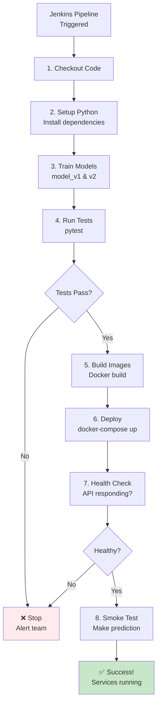

# Jenkins-Based Deployment Guide

This MLOps pipeline uses **Jenkins for CI/CD** to automate the entire deployment process.

## 🎯 Overview

Instead of manually running docker-compose, Jenkins handles everything:
- ✅ Code checkout
- ✅ Dependency installation
- ✅ Model training
- ✅ Testing
- ✅ Docker image building
- ✅ Service deployment
- ✅ Health checks

## 🚀 Quick Start (2 Scripts)

### Step 1: Install Everything
```bash
chmod +x install.sh
sudo ./install.sh
```

This installs:
- Python 3
- Docker & Docker Compose
- Java (for Jenkins)
- Jenkins
- All Python dependencies
- Trains initial models

**Output shows:**
- Your public IP
- Jenkins URL
- Initial admin password

### Step 2: Complete Jenkins Setup

1. **Open Jenkins** in your browser (URL from step 1)
2. **Enter the initial password** (shown in step 1)
3. **Install suggested plugins** (click the button, wait 2-3 minutes)
4. **Create admin user** (or skip to use admin/password)
5. **Confirm Jenkins URL** (click Save and Finish)

### Step 3: Create Pipeline and Deploy
```bash
chmod +x setup_jenkins_pipeline.sh
sudo ./setup_jenkins_pipeline.sh
```

This script will:
- Ask if you completed Jenkins setup
- Create the MLOps pipeline job
- Trigger the first build
- Deploy all services

**That's it!** Your services are now running.

## 📊 What Happens During Deployment



## 🔧 Installation Details

### What install.sh Does

```bash
sudo ./install.sh
```

**Installs:**
1. System updates
2. Python 3 + pip + dev tools
3. Java 11 (Jenkins requirement)
4. Docker
5. Docker Compose
6. Jenkins
7. Python packages (Flask, Streamlit, scikit-learn, etc.)

**Configures:**
- Starts Docker service
- Adds users to docker group
- Starts Jenkins service
- Trains initial ML models

**Shows:**
```
========================================
Installation Complete!
========================================

Your Public IP: 54.123.45.67

Jenkins is running at:
  http://54.123.45.67:8080

Jenkins Initial Admin Password:
  abc123def456...

Next Steps:
1. Open Jenkins in your browser
2. Enter the initial admin password
3. Install suggested plugins
4. Create admin user
5. Run: sudo ./setup_jenkins_pipeline.sh
========================================
```

### What setup_jenkins_pipeline.sh Does

```bash
sudo ./setup_jenkins_pipeline.sh
```

**Checks:**
- Jenkins is running
- You completed initial setup

**Creates:**
- Jenkins pipeline job named "mlops-pipeline"
- Configured to use the Jenkinsfile
- Points to your local workspace

**Triggers:**
- First build automatically
- Deploys all services

**Shows:**
```
========================================
Jenkins Pipeline Setup Complete!
========================================

Access your Jenkins pipeline:
  http://54.123.45.67:8080/job/mlops-pipeline/

After deployment, access your services:
  Web UI:     http://54.123.45.67:8501
  API:        http://54.123.45.67:5000
  Prometheus: http://54.123.45.67:9090
  Jenkins:    http://54.123.45.67:8080
========================================
```

## 🎯 Service URLs

After deployment:

| Service | URL | Purpose |
|---------|-----|---------|
| **Web UI** | http://YOUR-IP:8501 | Interactive interface |
| **API** | http://YOUR-IP:5000 | REST API for predictions |
| **Prometheus** | http://YOUR-IP:9090 | Monitoring dashboard |
| **Jenkins** | http://YOUR-IP:8080 | CI/CD pipeline |

## 🔄 Making Changes

### Trigger New Deployment

**Option 1: Manual (Jenkins UI)**
1. Go to http://YOUR-IP:8080/job/mlops-pipeline/
2. Click "Build Now"
3. Watch the pipeline run

**Option 2: Automatic (Git Push)**
- Jenkins checks for changes every 5 minutes
- Automatically builds when code changes

**Option 3: API Call**
```bash
curl -X POST http://YOUR-IP:8080/job/mlops-pipeline/build \
  --user admin:your-password
```

### Update Models

1. Modify `app/train_model.py`
2. Trigger Jenkins build
3. Jenkins will:
   - Train new models
   - Run tests
   - Deploy if tests pass

### Update API

1. Modify `app/flask_app.py`
2. Trigger Jenkins build
3. Jenkins will:
   - Build new Docker image
   - Deploy updated API
   - Run health checks

### Change A/B Split

1. Edit `docker-compose.yml`:
```yaml
environment:
  - MODEL_V1_WEIGHT=70
  - MODEL_V2_WEIGHT=30
```

2. Trigger Jenkins build
3. New split takes effect

## 📈 Monitoring Builds

### Jenkins Dashboard

**View Pipeline:**
```
http://YOUR-IP:8080/job/mlops-pipeline/
```

Shows:
- Build history
- Success/failure status
- Build duration
- Trends over time

### View Build Details

Click on any build number to see:
- **Console Output** - Full logs
- **Changes** - What code changed
- **Test Results** - pytest results
- **Artifacts** - Trained models

### Build Stages

Each build shows 8 stages:
1. ✅ Checkout
2. ✅ Setup Environment
3. ✅ Train Models
4. ✅ Run Tests
5. ✅ Build Docker Images
6. ✅ Push Images (optional)
7. ✅ Deploy
8. ✅ Health Check
9. ✅ Smoke Test

Click any stage to see its logs.

## 🔐 Security Setup (AWS)

### Required Ports

Open these ports in your Security Group:

| Port | Service | Required |
|------|---------|----------|
| 22 | SSH | Yes |
| 5000 | Flask API | Yes |
| 8080 | Jenkins | Yes |
| 8501 | Streamlit | Yes |
| 9090 | Prometheus | Yes |

### AWS Console

1. Go to EC2 → Security Groups
2. Find your instance's security group
3. Edit inbound rules
4. Add rules for each port above
5. Source: 0.0.0.0/0 (or your IP for security)

### AWS CLI

```bash
# Get your security group ID
SG_ID=$(aws ec2 describe-instances \
  --instance-ids YOUR-INSTANCE-ID \
  --query 'Reservations[0].Instances[0].SecurityGroups[0].GroupId' \
  --output text)

# Add all required ports
for PORT in 5000 8080 8501 9090; do
  aws ec2 authorize-security-group-ingress \
    --group-id $SG_ID \
    --protocol tcp \
    --port $PORT \
    --cidr 0.0.0.0/0
done
```

## 🧪 Testing

### Test API

```bash
# Get your IP
IP=$(curl -s https://api.ipify.org)

# Health check
curl http://$IP:5000/health

# Make prediction
curl -X POST http://$IP:5000/predict \
  -H "Content-Type: application/json" \
  -d '{"features": [5.1, 3.5, 1.4, 0.2]}'
```

### Test Web UI

Open in browser:
```
http://YOUR-IP:8501
```

### Test Prometheus

Open in browser:
```
http://YOUR-IP:9090
```

Query: `prediction_requests_total`

### Run Test Script

```bash
chmod +x test_everything.sh
./test_everything.sh
```

## 🔧 Troubleshooting

### Jenkins Won't Start

```bash
# Check status
sudo systemctl status jenkins

# Check logs
sudo journalctl -u jenkins -n 50

# Restart
sudo systemctl restart jenkins
```

### Can't Access Jenkins

**Check 1: Is it running?**
```bash
sudo systemctl status jenkins
```

**Check 2: Is port open?**
```bash
sudo netstat -tuln | grep 8080
```

**Check 3: Security Group (AWS)**
- Verify port 8080 is allowed

**Check 4: Get password**
```bash
sudo cat /var/lib/jenkins/secrets/initialAdminPassword
```

### Pipeline Fails

**View Console Output:**
1. Go to Jenkins
2. Click on the build number
3. Click "Console Output"
4. Look for error messages

**Common Issues:**

**Docker permission denied:**
```bash
sudo usermod -aG docker jenkins
sudo systemctl restart jenkins
```

**Models not found:**
```bash
python3 app/train_model.py
```

**Port already in use:**
```bash
docker-compose down
sudo lsof -ti:5000 | xargs kill -9
```

### Services Not Accessible

**Check if running:**
```bash
docker-compose ps
```

**Check logs:**
```bash
docker-compose logs flask-api
docker-compose logs streamlit-ui
```

**Restart services:**
```bash
# Via Jenkins (recommended)
# Go to Jenkins and click "Build Now"

# Or manually
docker-compose restart flask-api streamlit-ui
```

## 📚 Advanced Usage

### Schedule Builds

In Jenkins pipeline configuration:
- Build Triggers → Build periodically
- Schedule: `H 2 * * *` (daily at 2 AM)

### Email Notifications

1. Install "Email Extension" plugin
2. Configure SMTP in Jenkins settings
3. Add to Jenkinsfile:
```groovy
post {
    failure {
        emailext (
            subject: "Build Failed: ${env.JOB_NAME}",
            body: "Check console output at ${env.BUILD_URL}",
            to: "team@example.com"
        )
    }
}
```

### Slack Notifications

1. Install "Slack Notification" plugin
2. Configure Slack webhook
3. Add to Jenkinsfile:
```groovy
post {
    success {
        slackSend color: 'good', message: 'Build succeeded!'
    }
}
```

### Parallel Stages

```groovy
stage('Parallel Tests') {
    parallel {
        stage('Unit Tests') {
            steps {
                sh 'pytest tests/unit'
            }
        }
        stage('Integration Tests') {
            steps {
                sh 'pytest tests/integration'
            }
        }
    }
}
```

## ✅ Verification Checklist

After setup, verify:

- [ ] Jenkins accessible at http://YOUR-IP:8080
- [ ] Pipeline job created
- [ ] First build completed successfully
- [ ] Web UI accessible at http://YOUR-IP:8501
- [ ] API accessible at http://YOUR-IP:5000
- [ ] Prometheus accessible at http://YOUR-IP:9090
- [ ] Can make predictions via UI
- [ ] Can make predictions via API
- [ ] Metrics showing in Prometheus
- [ ] No errors in Jenkins console output

**Quick Check:**
```bash
./test_everything.sh
```

## 🎉 Success!

You now have a fully automated MLOps pipeline!

**What you can do:**
- ✅ Push code → Automatic deployment
- ✅ Monitor builds in Jenkins
- ✅ View metrics in Prometheus
- ✅ Make predictions via UI or API
- ✅ A/B test model versions
- ✅ Track model drift

**Next steps:**
1. Make a code change
2. Trigger a build
3. Watch Jenkins deploy it
4. Test the changes
5. Monitor in Prometheus

---

**Need help?** Check the troubleshooting section or run `./test_everything.sh`
