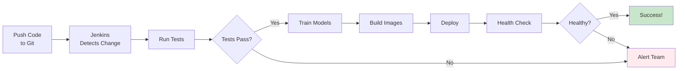

# Jenkins Integration - Complete ✅

## What Was Added

Jenkins CI/CD is now fully integrated into the MLOps pipeline!

## 📦 New Files Created

1. **install_jenkins.sh** - Automated Jenkins installation script
2. **JENKINS_SETUP.md** - Complete Jenkins setup and usage guide
3. **JENKINS_INTEGRATION_COMPLETE.md** - This file

## 🔧 Modified Files

1. **docker-compose.yml** - Added Jenkins container
2. **test_everything.sh** - Added Jenkins testing
3. **README.md** - Added Jenkins documentation

## 🚀 Two Ways to Run Jenkins

### Option 1: Docker (Recommended)

Jenkins is now part of docker-compose.yml:

```bash
# Start all services including Jenkins
docker-compose up -d

# Get Jenkins password
docker exec mlops-jenkins cat /var/jenkins_home/secrets/initialAdminPassword

# Access at http://YOUR-IP:8080
```

**Advantages:**
- ✅ Starts with other services
- ✅ Easy to manage
- ✅ Isolated environment
- ✅ No system dependencies

### Option 2: System Service

Install Jenkins as a standalone service:

```bash
# Run the installer
chmod +x install_jenkins.sh
sudo ./install_jenkins.sh

# Access at http://YOUR-IP:8080
```

**Advantages:**
- ✅ Runs independently
- ✅ Better for production
- ✅ More control
- ✅ Persistent across reboots

## 📊 What's Included

### Jenkins Container Configuration

```yaml
jenkins:
  image: jenkins/jenkins:lts
  ports:
    - "8080:8080"    # Web UI
    - "50000:50000"  # Agent communication
  volumes:
    - jenkins-data:/var/jenkins_home
    - /var/run/docker.sock:/var/run/docker.sock
    - ./:/workspace
```

### Pipeline Stages

Your Jenkinsfile includes:

1. **Checkout** - Get code from repository
2. **Setup** - Install Python dependencies
3. **Train Models** - Run model training
4. **Test** - Run pytest tests
5. **Build** - Create Docker images
6. **Deploy** - Start services
7. **Health Check** - Verify API
8. **Smoke Test** - Test predictions

### Test Script Updates

`test_everything.sh` now tests:
- ✅ Jenkins container status
- ✅ Jenkins web UI accessibility
- ✅ Shows Jenkins URL with public IP

## 🎯 Quick Start

### Start Jenkins (Docker)

```bash
# Start all services
docker-compose up -d

# Wait 30 seconds for Jenkins to initialize
sleep 30

# Get password
docker exec mlops-jenkins cat /var/jenkins_home/secrets/initialAdminPassword

# Get your IP
./get_ip.sh

# Open http://YOUR-IP:8080
```

### Start Jenkins (System Service)

```bash
# Install
sudo ./install_jenkins.sh

# The script shows you:
# - Jenkins URL
# - Initial password
# - Next steps
```

## 📋 Complete Setup Flow

### 1. Start Jenkins
```bash
docker-compose up -d
# or
sudo ./install_jenkins.sh
```

### 2. Get Initial Password
```bash
# Docker
docker exec mlops-jenkins cat /var/jenkins_home/secrets/initialAdminPassword

# System
sudo cat /var/lib/jenkins/secrets/initialAdminPassword
```

### 3. Access Jenkins
```bash
# Get your IP
./get_ip.sh

# Open in browser
http://YOUR-IP:8080
```

### 4. Initial Configuration
1. Enter initial password
2. Install suggested plugins
3. Create admin user
4. Confirm Jenkins URL

### 5. Create Pipeline
1. New Item → Pipeline
2. Name: `mlops-pipeline`
3. Pipeline script from SCM
4. Point to Jenkinsfile
5. Save

### 6. Run Pipeline
1. Click "Build Now"
2. Watch it run!
3. Check console output

## 🔐 Security Setup

### AWS Security Group

Add inbound rule for port 8080:

```bash
# Via AWS Console
EC2 → Security Groups → Edit inbound rules
Add: Custom TCP, Port 8080, Source 0.0.0.0/0

# Via CLI
aws ec2 authorize-security-group-ingress \
  --group-id YOUR-SG-ID \
  --protocol tcp \
  --port 8080 \
  --cidr 0.0.0.0/0
```

### Firewall (if enabled)

```bash
sudo firewall-cmd --permanent --add-port=8080/tcp
sudo firewall-cmd --reload
```

## 📊 Service URLs

After starting everything:

```
Web UI:     http://YOUR-IP:8501
API:        http://YOUR-IP:5000
Prometheus: http://YOUR-IP:9090
Jenkins:    http://YOUR-IP:8080  ← NEW!
```

## ✅ Verification

### Check Jenkins is Running

**Docker:**
```bash
docker-compose ps jenkins
# Should show "Up"
```

**System:**
```bash
sudo systemctl status jenkins
# Should show "active (running)"
```

### Test Jenkins Access

```bash
curl http://localhost:8080/login
# Should return HTML
```

### Run Complete Test

```bash
./test_everything.sh
# Should show Jenkins as PASS or WARN
```

## 🎨 Jenkins Features

### What You Get

1. **Automated Builds**
   - Trigger on Git push
   - Scheduled builds
   - Manual triggers

2. **Pipeline Visualization**
   - See each stage
   - Stage duration
   - Success/failure status

3. **Build History**
   - All past builds
   - Trends over time
   - Success rate

4. **Test Results**
   - pytest results
   - Test trends
   - Failure analysis

5. **Artifacts**
   - Trained models
   - Docker images
   - Build logs

6. **Notifications**
   - Email alerts
   - Slack integration
   - Custom webhooks

## 🔄 CI/CD Workflow



## 📚 Documentation

### Main Guides

1. **JENKINS_SETUP.md** - Complete setup guide
   - Installation methods
   - Configuration steps
   - Pipeline creation
   - Troubleshooting

2. **README.md** - Updated with Jenkins info
   - Quick start
   - Service URLs
   - Integration overview

3. **Jenkinsfile** - Pipeline definition
   - All stages defined
   - Ready to use
   - Well commented

### Quick References

- **Start Jenkins**: `docker-compose up -d`
- **Get Password**: `docker exec mlops-jenkins cat /var/jenkins_home/secrets/initialAdminPassword`
- **Access**: `http://YOUR-IP:8080`
- **Logs**: `docker-compose logs jenkins`
- **Restart**: `docker-compose restart jenkins`

## 🎯 Use Cases

### Development Workflow

1. Developer pushes code
2. Jenkins automatically:
   - Runs tests
   - Trains models
   - Builds containers
   - Deploys to dev environment
3. Team gets notified of results

### Production Deployment

1. Merge to main branch
2. Jenkins:
   - Runs full test suite
   - Trains production models
   - Builds production images
   - Deploys to staging
   - Runs smoke tests
   - Deploys to production
3. Monitors deployment health

### Scheduled Tasks

1. Nightly model retraining
2. Weekly performance reports
3. Daily drift detection
4. Monthly model evaluation

## 🔧 Customization

### Add More Stages

Edit `Jenkinsfile`:

```groovy
stage('Custom Stage') {
    steps {
        echo 'Running custom task...'
        sh 'your-command-here'
    }
}
```

### Add Notifications

Install plugins:
- Email Extension
- Slack Notification
- Discord Notifier

Configure in pipeline:

```groovy
post {
    success {
        slackSend color: 'good', message: 'Build succeeded!'
    }
    failure {
        slackSend color: 'danger', message: 'Build failed!'
    }
}
```

### Add Parallel Stages

```groovy
stage('Parallel Tests') {
    parallel {
        stage('Unit Tests') {
            steps {
                sh 'pytest tests/unit'
            }
        }
        stage('Integration Tests') {
            steps {
                sh 'pytest tests/integration'
            }
        }
    }
}
```

## 🎓 Learning Resources

### Official Documentation
- Jenkins Docs: https://www.jenkins.io/doc/
- Pipeline Syntax: https://www.jenkins.io/doc/book/pipeline/syntax/
- Best Practices: https://www.jenkins.io/doc/book/pipeline/pipeline-best-practices/

### Tutorials
- Getting Started: https://www.jenkins.io/doc/tutorials/
- Pipeline Tutorial: https://www.jenkins.io/doc/pipeline/tour/getting-started/

### Plugins
- Plugin Index: https://plugins.jenkins.io/
- Blue Ocean: https://plugins.jenkins.io/blueocean/
- Docker Pipeline: https://plugins.jenkins.io/docker-workflow/

## ✨ Summary

Jenkins is now fully integrated! You have:

- ✅ Jenkins container in docker-compose
- ✅ Standalone installation script
- ✅ Complete setup guide
- ✅ Working Jenkinsfile
- ✅ Automated testing
- ✅ Test script integration
- ✅ Documentation

**Next Steps:**

1. Start Jenkins: `docker-compose up -d`
2. Access UI: `http://YOUR-IP:8080`
3. Create pipeline job
4. Run your first build
5. Set up Git webhooks
6. Configure notifications

**Need Help?**

- Read: [JENKINS_SETUP.md](JENKINS_SETUP.md)
- Test: `./test_everything.sh`
- Logs: `docker-compose logs jenkins`

---

**Jenkins is ready to automate your MLOps workflow!** 🚀
