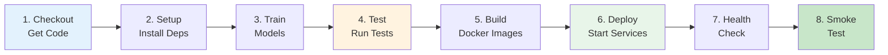

# Jenkins CI/CD Setup Guide

Jenkins is now integrated into the MLOps pipeline! You can run it either as a Docker container or as a system service.

## 🚀 Quick Start (Docker - Recommended)

Jenkins is already configured in `docker-compose.yml`. Just start it:

```bash
# Start all services including Jenkins
docker-compose up -d

# Check if Jenkins is running
docker-compose ps

# Get Jenkins initial password
docker exec mlops-jenkins cat /var/jenkins_home/secrets/initialAdminPassword

# Get your public IP
./get_ip.sh

# Access Jenkins at: http://YOUR-IP:8080
```

## 📋 Two Installation Methods

### Method 1: Docker (Included in docker-compose.yml) ✅

**Advantages:**
- Already configured
- Starts with other services
- Easy to manage
- Isolated environment

**Start Jenkins:**
```bash
docker-compose up -d
```

**Get Initial Password:**
```bash
docker exec mlops-jenkins cat /var/jenkins_home/secrets/initialAdminPassword
```

**Access:**
```
http://YOUR-IP:8080
```

---

### Method 2: System Service (Standalone)

**Advantages:**
- Runs independently
- Better for production
- More control

**Install:**
```bash
chmod +x install_jenkins.sh
sudo ./install_jenkins.sh
```

**Access:**
```
http://YOUR-IP:8080
```

The script will show you the initial admin password.

---

## 🔧 Initial Jenkins Configuration

### Step 1: First Login

1. Open `http://YOUR-IP:8080` in your browser
2. Enter the initial admin password (from above)
3. Click **Continue**

### Step 2: Install Plugins

Choose **Install suggested plugins**

This installs:
- Git
- Pipeline
- Docker Pipeline
- Credentials
- And more...

Wait for installation to complete (~2-3 minutes).

### Step 3: Create Admin User

Fill in the form:
- Username: `admin`
- Password: (choose a strong password)
- Full name: Your name
- Email: your@email.com

Click **Save and Continue**

### Step 4: Confirm Jenkins URL

Should show: `http://YOUR-IP:8080/`

Click **Save and Finish**

Click **Start using Jenkins**

---

## 🎯 Creating Your First Pipeline

### Step 1: Create New Job

1. Click **New Item**
2. Enter name: `mlops-pipeline`
3. Select **Pipeline**
4. Click **OK**

### Step 2: Configure Pipeline

**General Section:**
- Description: `MLOps Pipeline with A/B Testing`

**Build Triggers:**
- ☑ Poll SCM (optional)
- Schedule: `H/5 * * * *` (check every 5 minutes)

**Pipeline Section:**
- Definition: **Pipeline script from SCM**
- SCM: **Git**
- Repository URL: 
  - If using Git: `https://github.com/your-username/mlops-pipeline.git`
  - If local: `/workspace` (for Docker) or `/path/to/project`
- Branch: `*/main` or `*/master`
- Script Path: `Jenkinsfile`

Click **Save**

### Step 3: Run Pipeline

1. Click **Build Now**
2. Watch the build progress
3. Click on the build number to see details
4. Click **Console Output** to see logs

---

## 📊 What the Pipeline Does

Your `Jenkinsfile` runs these stages:



**Stage Details:**

1. **Checkout** - Gets your code from Git
2. **Setup** - Installs Python dependencies
3. **Train Models** - Runs `train_model.py`
4. **Test** - Runs pytest tests
5. **Build** - Creates Docker images
6. **Deploy** - Starts services with docker-compose
7. **Health Check** - Verifies API is responding
8. **Smoke Test** - Makes a test prediction

---

## 🔐 Security Group Setup (AWS)

If running on AWS EC2, open port 8080:

**AWS Console:**
1. Go to EC2 → Security Groups
2. Find your instance's security group
3. Click **Edit inbound rules**
4. Click **Add rule**
5. Configure:
   - Type: Custom TCP
   - Port: 8080
   - Source: 0.0.0.0/0 (or your IP for security)
6. Click **Save rules**

**Via AWS CLI:**
```bash
aws ec2 authorize-security-group-ingress \
  --group-id YOUR-SG-ID \
  --protocol tcp \
  --port 8080 \
  --cidr 0.0.0.0/0
```

---

## 🎨 Jenkins Dashboard Overview

After setup, you'll see:

**Main Dashboard:**
- List of all jobs
- Build history
- Build queue
- Build executor status

**Job Dashboard:**
- Build history graph
- Last successful build
- Last failed build
- Build trends

**Build Details:**
- Console output
- Test results
- Build artifacts
- Changes since last build

---

## 🔄 Triggering Builds

### Manual Trigger
1. Go to your pipeline
2. Click **Build Now**
3. Watch it run!

### Automatic Trigger (Git Push)

**Step 1: Install GitHub Plugin**
- Manage Jenkins → Plugins
- Search for "GitHub"
- Install and restart

**Step 2: Configure Webhook**
In your GitHub repo:
- Settings → Webhooks → Add webhook
- Payload URL: `http://YOUR-IP:8080/github-webhook/`
- Content type: `application/json`
- Events: Just the push event
- Click **Add webhook**

**Step 3: Update Pipeline**
In your pipeline configuration:
- Build Triggers → ☑ GitHub hook trigger for GITScm polling

Now Jenkins builds automatically when you push code!

### Scheduled Builds

In pipeline configuration:
- Build Triggers → ☑ Build periodically
- Schedule examples:
  - `H 2 * * *` - Daily at 2 AM
  - `H/15 * * * *` - Every 15 minutes
  - `H 0 * * 1-5` - Weekdays at midnight

---

## 📈 Monitoring Jenkins

### Check Jenkins Status

**Docker:**
```bash
docker-compose ps jenkins
docker-compose logs jenkins
```

**System Service:**
```bash
sudo systemctl status jenkins
sudo journalctl -u jenkins -f
```

### View Build Logs
```bash
# Docker
docker exec mlops-jenkins cat /var/jenkins_home/jobs/mlops-pipeline/builds/1/log

# System service
sudo cat /var/lib/jenkins/jobs/mlops-pipeline/builds/1/log
```

### Jenkins Metrics
Access: `http://YOUR-IP:8080/metrics`

Shows:
- Build queue length
- Executor usage
- Job success rate
- Build duration

---

## 🔧 Troubleshooting

### Jenkins Won't Start

**Docker:**
```bash
# Check logs
docker-compose logs jenkins

# Restart
docker-compose restart jenkins

# Rebuild
docker-compose down
docker-compose up -d --build jenkins
```

**System Service:**
```bash
# Check status
sudo systemctl status jenkins

# Check logs
sudo journalctl -u jenkins -n 50

# Restart
sudo systemctl restart jenkins
```

### Can't Access Jenkins UI

**Check 1: Is Jenkins running?**
```bash
# Docker
docker-compose ps jenkins

# System
sudo systemctl status jenkins
```

**Check 2: Is port 8080 open?**
```bash
sudo netstat -tuln | grep 8080
```

**Check 3: Security Group (AWS)**
- Verify port 8080 is allowed in Security Group

**Check 4: Firewall**
```bash
sudo firewall-cmd --list-all
sudo firewall-cmd --permanent --add-port=8080/tcp
sudo firewall-cmd --reload
```

### Pipeline Fails

**Check 1: View Console Output**
- Click on the build number
- Click **Console Output**
- Look for error messages

**Check 2: Verify Dependencies**
```bash
# Docker has everything
# System service needs:
docker --version
docker-compose --version
python3 --version
```

**Check 3: Check Permissions**
```bash
# Jenkins user needs docker access
sudo usermod -aG docker jenkins
sudo systemctl restart jenkins
```

### Initial Password Not Found

**Docker:**
```bash
docker exec mlops-jenkins cat /var/jenkins_home/secrets/initialAdminPassword
```

**System Service:**
```bash
sudo cat /var/lib/jenkins/secrets/initialAdminPassword
```

If file doesn't exist, Jenkins is still initializing. Wait 30 seconds and try again.

---

## 🎯 Best Practices

### 1. Secure Jenkins
- Change admin password
- Enable CSRF protection
- Use HTTPS (with reverse proxy)
- Limit user permissions

### 2. Backup Jenkins
```bash
# Docker
docker exec mlops-jenkins tar -czf /tmp/jenkins-backup.tar.gz /var/jenkins_home
docker cp mlops-jenkins:/tmp/jenkins-backup.tar.gz ./

# System
sudo tar -czf jenkins-backup.tar.gz /var/lib/jenkins
```

### 3. Monitor Builds
- Set up email notifications
- Use Slack/Discord webhooks
- Monitor build trends

### 4. Optimize Performance
- Increase executor count
- Use build agents for parallel builds
- Clean old builds regularly

---

## 📚 Additional Resources

### Jenkins Documentation
- Official Docs: https://www.jenkins.io/doc/
- Pipeline Syntax: https://www.jenkins.io/doc/book/pipeline/syntax/
- Plugins: https://plugins.jenkins.io/

### Useful Plugins
- Blue Ocean (modern UI)
- Pipeline Stage View
- Build Monitor
- Email Extension
- Slack Notification

### Learning Resources
- Jenkins Tutorial: https://www.jenkins.io/doc/tutorials/
- Pipeline Examples: https://www.jenkins.io/doc/pipeline/examples/

---

## ✅ Verification Checklist

After setup, verify:

- [ ] Jenkins accessible at `http://YOUR-IP:8080`
- [ ] Can log in with admin credentials
- [ ] Pipeline job created
- [ ] Pipeline points to Jenkinsfile
- [ ] Can trigger build manually
- [ ] Build completes successfully
- [ ] All stages pass
- [ ] Services deploy correctly
- [ ] Health checks pass

**Quick Test:**
```bash
# Run the test script
./test_everything.sh

# Should show Jenkins as running
```

---

## 🎉 Success!

You now have Jenkins integrated into your MLOps pipeline!

**What you can do:**
- ✅ Automated testing on every commit
- ✅ Automated deployment
- ✅ Build history and trends
- ✅ Email/Slack notifications
- ✅ Scheduled builds
- ✅ Parallel builds

**Next steps:**
1. Configure Git webhooks for auto-builds
2. Set up notifications
3. Add more test stages
4. Create deployment environments (dev/staging/prod)

---

**Need help?** Check the troubleshooting section or run `./test_everything.sh` to diagnose issues.
