# MLOps Pipeline - Complete Machine Learning Deployment System

This is a complete, production-ready system for deploying machine learning models. It shows you everything from training models to serving predictions to real users, with monitoring and A/B testing built in.

**Perfect for:** Learning MLOps, building your portfolio, or deploying real ML models to production.

## Table of Contents

- [What is Machine Learning?](#what-is-machine-learning)
- [What Does Our Model Predict?](#what-does-our-model-predict)
- [How the System Works](#how-the-system-works)
- [Quick Start](#quick-start)
- [Using the System](#using-the-system)
- [Understanding A/B Testing](#understanding-ab-testing)
- [Monitoring and Drift Detection](#monitoring-and-drift-detection)
- [AWS Deployment](#aws-deployment)
- [Troubleshooting](#troubleshooting)
- [Advanced Topics](#advanced-topics)

---

## What is Machine Learning?

Machine learning is teaching computers to learn from examples instead of programming them with explicit rules.

### Traditional Programming vs Machine Learning


**Traditional Programming:** You write rules manually
- IF petal length > 5cm AND petal width > 2cm THEN it's Virginica
- Problem: Hard to write rules for complex patterns

**Machine Learning:** The computer learns rules from examples
- Show it 1000 flowers with measurements and labels
- It figures out the patterns automatically
- Can handle complex relationships humans can't easily describe

### How Our Model Learns

```mermaid
flowchart TD
    A[📊 Training Data<br/>150 iris flowers<br/>with measurements] --> B[🎓 Training Process]
    B --> C[🌳 Decision Trees<br/>Ask questions about data]
    C --> D[🤖 Trained Model<br/>Knows patterns]
    
    E[❓ New Flower<br/>Unknown type] --> D
    D --> F[✅ Prediction<br/>It's a Setosa!]
    
    style A fill:#e3f2fd
    style B fill:#fff3e0
    style D fill:#e8f5e9
    style F fill:#c8e6c9
```

**The Training Process:**
1. **Collect Data:** Gather examples (150 iris flowers with measurements)
2. **Label Data:** Mark what each example is (Setosa, Versicolor, or Virginica)
3. **Train Model:** Algorithm learns patterns from the data
4. **Test Model:** Check if it can predict correctly on new flowers
5. **Deploy Model:** Put it in production to make real predictions

---

## What Does Our Model Predict?

Our model predicts the species of iris flowers based on their physical measurements.

### The Iris Flower Dataset

The Iris dataset is famous in machine learning - it's like the "Hello World" of ML. It contains measurements of 150 iris flowers from three different species.

```mermaid
flowchart TB
    subgraph "Input: Flower Measurements"
        I1[📏 Sepal Length<br/>4.0 - 8.0 cm]
        I2[📏 Sepal Width<br/>2.0 - 4.5 cm]
        I3[📏 Petal Length<br/>1.0 - 7.0 cm]
        I4[📏 Petal Width<br/>0.1 - 2.5 cm]
    end
    
    subgraph "Machine Learning Model"
        M[🤖 Random Forest<br/>Trained on 150 flowers]
    end
    
    subgraph "Output: Flower Species"
        O1[🌸 Setosa<br/>Small petals]
        O2[🌺 Versicolor<br/>Medium petals]
        O3[🌻 Virginica<br/>Large petals]
    end
    
    I1 --> M
    I2 --> M
    I3 --> M
    I4 --> M
    
    M --> O1
    M --> O2
    M --> O3
    
    style M fill:#fff3e0
    style O1 fill:#e8f5e9
    style O2 fill:#e8f5e9
    style O3 fill:#e8f5e9
```

### The Three Iris Species

**1. Iris Setosa** (Class 0)
- Small flowers
- Short, wide petals
- Easy to identify
- Example: Sepal Length=5.1, Sepal Width=3.5, Petal Length=1.4, Petal Width=0.2

**2. Iris Versicolor** (Class 1)
- Medium-sized flowers
- Moderate petal dimensions
- Sometimes confused with Virginica
- Example: Sepal Length=6.0, Sepal Width=2.9, Petal Length=4.5, Petal Width=1.5

**3. Iris Virginica** (Class 2)
- Large flowers
- Long, wide petals
- Largest of the three species
- Example: Sepal Length=6.5, Sepal Width=3.0, Petal Length=5.2, Petal Width=2.0

### How the Model Makes Predictions

```mermaid
flowchart TD
    START[🌸 New Flower<br/>Sepal: 5.1, 3.5<br/>Petal: 1.4, 0.2] --> Q1{Petal Length<br/>< 2.5 cm?}
    
    Q1 -->|Yes| SETOSA[✅ Setosa<br/>Confidence: 100%]
    Q1 -->|No| Q2{Petal Width<br/>< 1.8 cm?}
    
    Q2 -->|Yes| Q3{Petal Length<br/>< 5.0 cm?}
    Q2 -->|No| VIRGINICA[✅ Virginica<br/>Confidence: 95%]
    
    Q3 -->|Yes| VERSICOLOR[✅ Versicolor<br/>Confidence: 90%]
    Q3 -->|No| VIRGINICA2[✅ Virginica<br/>Confidence: 85%]
    
    style SETOSA fill:#c8e6c9
    style VERSICOLOR fill:#c8e6c9
    style VIRGINICA fill:#c8e6c9
    style VIRGINICA2 fill:#c8e6c9
```

This is a simplified view of how a decision tree works. Our actual model uses 50-100 trees (Random Forest) to make more accurate predictions.

### Why Two Model Versions?

We have two versions of the model:

**Model v1: Fast but Less Accurate**
- Uses 50 decision trees
- Faster predictions (~10ms)
- Accuracy: ~95%
- Good for high-traffic scenarios

**Model v2: Slower but More Accurate**
- Uses 100 decision trees
- Slower predictions (~15ms)
- Accuracy: ~97%
- Better for critical predictions

This lets us test which one works better in production using A/B testing!

---

## How the System Works

This system takes your machine learning model and makes it available to users through a web interface and API, with monitoring and A/B testing built in.

### Complete System Architecture

```mermaid
graph TB
    subgraph "Users"
        U1[👤 Web User]
        U2[💻 API User]
        U3[👨‍💼 Data Scientist]
    end
    
    subgraph "Interface Layer"
        UI[🎨 Streamlit Web UI<br/>Port 8501<br/>Interactive Interface]
        API[🔌 Flask REST API<br/>Port 5000<br/>JSON Endpoints]
    end
    
    subgraph "Business Logic"
        ROUTER[🔀 A/B Router<br/>Traffic Splitter<br/>50/50 by default]
    end
    
    subgraph "ML Models"
        M1[🤖 Model v1<br/>Random Forest 50 trees<br/>Fast & Efficient]
        M2[🤖 Model v2<br/>Random Forest 100 trees<br/>More Accurate]
    end
    
    subgraph "Data Storage"
        MODELS[(💾 Model Files<br/>model_v1.pkl<br/>model_v2.pkl)]
        STATS[(📊 Training Stats<br/>For drift detection)]
    end
    
    subgraph "Monitoring"
        PROM[📈 Prometheus<br/>Port 9090<br/>Metrics & Graphs]
        METRICS[📊 Metrics Collector<br/>Counts, Latency, Errors]
        DRIFT[🔍 Drift Detector<br/>Model Performance]
    end
    
    subgraph "DevOps"
        JENKINS[🔄 Jenkins CI/CD<br/>Automated Deployment]
        DOCKER[🐳 Docker Compose<br/>Container Orchestration]
    end
    
    U1 --> UI
    U2 --> API
    U3 --> JENKINS
    
    UI --> API
    API --> ROUTER
    
    ROUTER -->|50%| M1
    ROUTER -->|50%| M2
    
    M1 --> MODELS
    M2 --> MODELS
    
    API --> METRICS
    METRICS --> PROM
    
    DRIFT --> STATS
    DRIFT --> PROM
    
    JENKINS --> DOCKER
    DOCKER --> API
    DOCKER --> UI
    DOCKER --> PROM
    
    style U1 fill:#e3f2fd
    style U2 fill:#e3f2fd
    style U3 fill:#e3f2fd
    style UI fill:#f3e5f5
    style API fill:#fff3e0
    style M1 fill:#e8f5e9
    style M2 fill:#e8f5e9
    style PROM fill:#fce4ec
```

### Technology Stack

Here's what powers the system (don't worry, the install script handles everything):

| Component | Technology | Purpose |
|-----------|-----------|---------|
| **Language** | Python 3.9 | Core programming language |
| **ML Library** | scikit-learn | Train and run models |
| **API Framework** | Flask | Serve predictions via REST API |
| **UI Framework** | Streamlit | Create web interface without HTML/CSS |
| **Containerization** | Docker | Package everything consistently |
| **Orchestration** | Docker Compose | Manage multiple containers |
| **Monitoring** | Prometheus | Track metrics and performance |
| **CI/CD** | Jenkins | Automate testing and deployment |
| **Testing** | pytest | Unit and integration tests |

### How a Prediction Flows Through the System

Let's follow a single prediction request from start to finish:


**Step-by-Step Breakdown:**

1. **User Input:** User enters flower measurements in the web interface
2. **API Request:** UI sends data to Flask API as JSON
3. **Routing Decision:** A/B router decides which model to use (random 50/50)
4. **Model Loading:** Selected model loads from disk (cached after first use)
5. **Prediction:** Model processes the features and returns a class (0, 1, or 2)
6. **Response Building:** API packages the result with metadata
7. **Metrics Update:** System records the request for monitoring
8. **Return to User:** Result sent back through UI
9. **Display:** User sees the flower type and which model was used

### Real-World Example

Let's say you enter these measurements:
- Sepal Length: 6.5 cm
- Sepal Width: 3.0 cm
- Petal Length: 5.2 cm
- Petal Width: 2.0 cm

**What happens:**


The model looks at the large petal dimensions (5.2 cm length, 2.0 cm width) and correctly identifies it as Virginica!

---

## Quick Start

```mermaid
flowchart TB
    subgraph "The Customer"
        USER[👤 You<br/>Want a prediction]
    end
    
    subgraph "The Front Door"
        UI[🎨 Web Interface<br/>Easy to use]
    end
    
    subgraph "The Kitchen"
        API[🍳 API Server<br/>Takes your request]
        ROUTER[🔀 Smart Router<br/>Picks which model]
    end
    
    subgraph "The Chefs"
        M1[👨‍🍳 Model v1<br/>First recipe]
        M2[👨‍🍳 Model v2<br/>Improved recipe]
    end
    
    subgraph "Quality Control"
        MONITOR[📊 Dashboard<br/>Tracks everything]
    end
    
    USER -->|Visits| UI
    UI -->|Sends data| API
    API -->|Routes to| ROUTER
    ROUTER -->|50% chance| M1
    ROUTER -->|50% chance| M2
    M1 -->|Prediction| API
    M2 -->|Prediction| API
    API -->|Result| UI
    API -->|Stats| MONITOR
    
    style USER fill:#e3f2fd
    style UI fill:#f3e5f5
    style API fill:#fff3e0
    style M1 fill:#e8f5e9
    style M2 fill:#e8f5e9
    style MONITOR fill:#fce4ec
```

**What's happening here?**

1. You (the user) visit the web interface
2. You enter some data (like flower measurements)
3. The API receives your request
4. A smart router randomly picks Model v1 or Model v2 (this is A/B testing!)
5. The chosen model makes a prediction
6. You get the result back
7. Everything is tracked in the monitoring dashboard

## Getting Started

### What You Need

- An Amazon Linux or Red Hat server (like an AWS EC2 instance)
- Ability to run commands as admin (sudo)
- Internet connection

Choose your installation method below: **Automated** (fast) or **Manual** (step-by-step).

---

## Installation Method 1: Automated (Recommended) ⚡

This is the fastest way - just 3 commands and you're done!

### Step 1: Make Scripts Executable
```bash
chmod +x *.sh
```

### Step 2: Run Installer (5 minutes)
```bash
./install.sh
```

This automatically installs:
- Python 3 and pip
- Docker and Docker Compose  
- All Python dependencies
- System packages

Grab a coffee! ☕

### Step 3: Start Everything
```bash
./run_demo.sh
```

This will:
- Train both ML models
- Build Docker containers
- Start all services

Takes about 2 minutes.

### Step 4: Test Everything & Get Your URLs
```bash
./test_everything.sh
```

This comprehensive test will:
- Test all 10 components
- **Automatically detect your public IP**
- Show you the correct URLs (not localhost!)
- Verify A/B testing works
- Check monitoring
- Measure performance

**Example Output:**
```
========================================
Detected IP Address: 54.123.45.67
========================================

Service URLs:
  API:        http://54.123.45.67:5000
  UI:         http://54.123.45.67:8501
  Prometheus: http://54.123.45.67:9090

Test the API:
  curl -X POST http://54.123.45.67:5000/predict \
    -H "Content-Type: application/json" \
    -d '{"features": [5.1, 3.5, 1.4, 0.2]}'
```

**Copy these URLs!** You'll use them to access your services.

---

## Installation Method 2: Manual (Step-by-Step) 📝

Prefer to see exactly what's happening? Follow these manual steps.

### Step 1: Update System

```bash
# Update package manager
sudo yum update -y
```

### Step 2: Install Python 3

```bash
# Install Python 3 and development tools
sudo yum install -y python3 python3-pip python3-devel gcc

# Verify installation
python3 --version  # Should show Python 3.x
pip3 --version     # Should show pip version
```

### Step 3: Install Docker

```bash
# Install Docker
sudo yum install -y docker

# Start Docker service
sudo systemctl start docker
sudo systemctl enable docker

# Add your user to docker group (so you don't need sudo)
sudo usermod -aG docker $USER

# Verify Docker installation
docker --version
```

**⚠️ Important:** After adding yourself to the docker group, **log out and log back in** for it to take effect!

### Step 4: Install Docker Compose

```bash
# Download Docker Compose
sudo curl -L "https://github.com/docker/compose/releases/download/v2.23.0/docker-compose-$(uname -s)-$(uname -m)" -o /usr/local/bin/docker-compose

# Make it executable
sudo chmod +x /usr/local/bin/docker-compose

# Create symlink
sudo ln -s /usr/local/bin/docker-compose /usr/bin/docker-compose

# Verify installation
docker-compose --version
```

### Step 5: Install Python Dependencies

```bash
# Upgrade pip
pip3 install --user --upgrade pip

# Install from requirements file
pip3 install --user -r requirements.txt

# Or install packages individually:
pip3 install --user flask==3.0.0 scikit-learn==1.3.2 numpy==1.24.3 \
  pandas==2.0.3 streamlit==1.29.0 prometheus-client==0.19.0 \
  requests==2.31.0 pytest==7.4.3 joblib==1.3.2
```

### Step 6: Train the Models

```bash
# Train both model versions
python3 app/train_model.py
```

**Expected Output:**
```
Loading Iris dataset...
Training Model v1 (Random Forest with 50 estimators)...
Model v1 Accuracy: 0.9667
Training Model v2 (Random Forest with 100 estimators)...
Model v2 Accuracy: 0.9667
Training complete!
```

### Step 7: Build Docker Containers

```bash
# Build the Flask API container
docker build -f docker/Dockerfile.api -t mlops-flask-api:latest .

# Build the Streamlit UI container
docker build -f docker/Dockerfile.streamlit -t mlops-streamlit-ui:latest .

# Verify images were created
docker images | grep mlops
```

### Step 8: Start All Services

```bash
# Start everything with Docker Compose
docker-compose up -d

# Check that all containers are running
docker-compose ps
```

**Expected Output:**
```
NAME                  STATUS
mlops-flask-api       Up
mlops-streamlit-ui    Up
mlops-prometheus      Up
```

### Step 9: Get Your Public IP Address

```bash
# Method 1: AWS metadata service (if on EC2)
curl -s http://169.254.169.254/latest/meta-data/public-ipv4

# Method 2: External service
curl -s https://api.ipify.org

# Method 3: Use the test script
./test_everything.sh
```

**Save this IP!** You'll use it to access your services.

### Step 10: Test Your Installation

```bash
# Make test script executable
chmod +x test_everything.sh

# Run comprehensive tests
./test_everything.sh
```

This will show you all your service URLs with the correct public IP address.

---

## Accessing Your Services

After installation (either method), you'll have three services running:

### 1. Web Interface (Streamlit)
```
http://YOUR-PUBLIC-IP:8501
```
- Open this in your browser
- Interactive interface for making predictions
- See which model version was used
- View usage statistics

### 2. API (Flask)
```
http://YOUR-PUBLIC-IP:5000
```
- REST API for programmatic access
- Endpoints: `/predict`, `/health`, `/config`, `/metrics`

### 3. Monitoring (Prometheus)
```
http://YOUR-PUBLIC-IP:9090
```
- View metrics and performance data
- Query prediction counts, latency, errors
- Monitor A/B test distribution

### 4. Jenkins CI/CD (Optional)
```
http://YOUR-PUBLIC-IP:8080
```
- Automated testing and deployment
- Build pipeline visualization
- Build history and trends
- **Setup:** See [JENKINS_SETUP.md](JENKINS_SETUP.md) for complete guide

### Getting Your Public IP

**Method 1: Use Our Helper Script (Easiest)**
```bash
chmod +x get_ip.sh
./get_ip.sh
```

This automatically detects your IP and shows you all the URLs!

**Method 2: AWS Metadata Service (EC2 only)**
```bash
curl -s http://169.254.169.254/latest/meta-data/public-ipv4
```

**Method 3: External Service**
```bash
curl -s https://api.ipify.org
```

**Method 4: Run Full Test**
```bash
./test_everything.sh
# Shows IP at the top of output
```

---

## Verifying Installation

### Quick Check
```bash
# Check if services are running
docker-compose ps

# All three should show "Up"
```

### Comprehensive Check
```bash
# Run full system test
./test_everything.sh

# Should show all green checkmarks
```

### Manual API Test
```bash
# Replace YOUR-IP with your actual public IP
curl http://YOUR-IP:5000/health

# Expected response:
# {"status":"healthy","timestamp":"2025-11-22T10:30:45","models_loaded":true}
```

### Make a Test Prediction
```bash
# Replace YOUR-IP with your actual public IP
curl -X POST http://YOUR-IP:5000/predict \
  -H "Content-Type: application/json" \
  -d '{"features": [5.1, 3.5, 1.4, 0.2]}'

# Expected response:
# {"prediction":0,"model_version":"v1","timestamp":"...","latency_ms":12.5}
```

---

## Troubleshooting Installation

### Docker Permission Denied
```bash
# Add yourself to docker group
sudo usermod -aG docker $USER

# Log out and log back in for it to take effect
exit
# Then SSH back in
```

### Ports Already in Use
```bash
# Stop existing services
docker-compose down

# Or kill specific port
sudo lsof -ti:5000 | xargs kill -9
sudo lsof -ti:8501 | xargs kill -9
sudo lsof -ti:9090 | xargs kill -9
```

### Models Not Found
```bash
# Train models manually
python3 app/train_model.py

# Restart API
docker-compose restart flask-api
```

### Services Won't Start
```bash
# Check logs for errors
docker-compose logs

# Check specific service
docker-compose logs flask-api

# Rebuild containers from scratch
docker-compose down
docker-compose build --no-cache
docker-compose up -d
```

### Can't Access from Browser

**Check 1: Services Running?**
```bash
docker-compose ps
# All should show "Up"
```

**Check 2: Using Public IP?**
```bash
# Get your public IP
curl -s https://api.ipify.org

# Don't use localhost or 127.0.0.1!
```

**Check 3: Security Group (AWS)**
- Go to EC2 → Security Groups
- Find your instance's security group
- Add Inbound Rules for ports: 5000, 8501, 9090
- Source: 0.0.0.0/0 (or your IP for security)

**Check 4: Firewall**
```bash
# Check firewall status
sudo firewall-cmd --list-all

# If needed, open ports
sudo firewall-cmd --permanent --add-port=5000/tcp
sudo firewall-cmd --permanent --add-port=8501/tcp
sudo firewall-cmd --permanent --add-port=9090/tcp
sudo firewall-cmd --reload
```

### Test Script Shows Failures

Run the verification script first:
```bash
./verify_setup.sh
```

This will tell you exactly what's missing.

---

## Next Steps After Installation

Once everything is running:

1. **Open the Web UI** at `http://YOUR-IP:8501`
2. **Make some predictions** using the sliders
3. **Check Prometheus** at `http://YOUR-IP:9090`
4. **Test the API** with curl commands
5. **Read the rest of this README** to understand the system

### Check If Everything Works

Run this comprehensive test:
```bash
./test_everything.sh
```

This will:
- Test all components
- Show you the URLs to access your services
- Tell you if anything is broken

**Important:** The test script automatically detects your server's IP address, so you'll get the right URLs whether you're on AWS, your local machine, or anywhere else!

## Using Your ML System

After running `./test_everything.sh`, you'll see your actual URLs. They'll look something like:
- `http://YOUR-IP:8501` (Web Interface)
- `http://YOUR-IP:5000` (API)
- `http://YOUR-IP:9090` (Monitoring)

### Option 1: Use the Web Interface (Easiest!)

Just open the Streamlit URL in your browser. You'll see:

1. **Sliders** to adjust flower measurements (sepal length, width, etc.)
2. A big **"Get Prediction"** button
3. The **result** showing which type of flower it is
4. Which **model version** made the prediction (v1 or v2)
5. **Statistics** showing how many times each model was used

It's super intuitive - just play around with it!

### Option 2: Call the API (For Developers)

Want to integrate this into your app? Here's how:

```bash
# Replace YOUR-IP with your actual IP from test_everything.sh
curl -X POST http://YOUR-IP:5000/predict \
  -H "Content-Type: application/json" \
  -d '{"features": [5.1, 3.5, 1.4, 0.2]}'
```

You'll get back something like:
```json
{
  "prediction": 0,
  "model_version": "v1",
  "timestamp": "2025-11-22T10:30:45",
  "latency_ms": 12.5
}
```

**What does this mean?**
- `prediction: 0` means it's a Setosa flower (0=Setosa, 1=Versicolor, 2=Virginica)
- `model_version: v1` tells you which model made this prediction
- `latency_ms: 12.5` shows it took 12.5 milliseconds

### Option 3: Check the Monitoring Dashboard

Open the Prometheus URL to see cool graphs:

- How many predictions you've made
- Which model is being used more
- How fast your API is responding
- If your model is "drifting" (getting less accurate over time)

Try searching for:
- `prediction_requests_total` - See total predictions
- `rate(prediction_requests_total[1m])` - Predictions per second

---

## Understanding A/B Testing

A/B testing is how companies like Netflix, Amazon, and Google test new features safely. Instead of switching everyone to a new version at once, they gradually roll it out.

### What is A/B Testing?

```mermaid
flowchart TB
    START[100 Users<br/>Make Requests] --> SPLIT{A/B Router}
    
    SPLIT -->|50 users| A[👥 Group A<br/>Gets Model v1<br/>Baseline]
    SPLIT -->|50 users| B[👥 Group B<br/>Gets Model v2<br/>New Version]
    
    A --> MA[📊 Metrics A<br/>Accuracy: 95%<br/>Speed: 10ms<br/>Errors: 2]
    B --> MB[📊 Metrics B<br/>Accuracy: 97%<br/>Speed: 15ms<br/>Errors: 1]
    
    MA --> COMPARE{📈 Compare<br/>Results}
    MB --> COMPARE
    
    COMPARE --> DECISION[🎯 Decision:<br/>v2 is better!<br/>More accurate<br/>Acceptable speed]
    
    style A fill:#e3f2fd
    style B fill:#f3e5f5
    style DECISION fill:#c8e6c9
```

**Why A/B Test?**

1. **Safety:** Don't break production for everyone
2. **Data-Driven:** Make decisions based on real metrics, not guesses
3. **Gradual Rollout:** Start with 10%, then 50%, then 100%
4. **Easy Rollback:** If v2 has problems, just set it to 0%

### A/B Testing Strategies


### How Our A/B Router Works

```mermaid
flowchart LR
    REQ[Incoming<br/>Request] --> RAND[Generate<br/>Random Number<br/>1-100]
    
    RAND --> CHECK{Number <= 50?}
    
    CHECK -->|Yes<br/>1-50| V1[Use Model v1<br/>Tag: version=v1]
    CHECK -->|No<br/>51-100| V2[Use Model v2<br/>Tag: version=v2]
    
    V1 --> PRED1[Make Prediction]
    V2 --> PRED2[Make Prediction]
    
    PRED1 --> METRIC[Record Metrics:<br/>- model_version_requests_total{version="v1"}<br/>- prediction_latency_seconds]
    PRED2 --> METRIC
    
    style V1 fill:#e3f2fd
    style V2 fill:#f3e5f5
    style METRIC fill:#fff3e0
```

**The Algorithm:**
```python
# Simplified version of our A/B router
def select_model():
    random_number = random.randint(1, 100)
    
    if random_number <= MODEL_V1_WEIGHT:  # Default: 50
        return model_v1, "v1"
    else:
        return model_v2, "v2"
```

### Configuring A/B Split

By default, each model gets 50% of the traffic. Want to change that? Here's how:

**Step 1:** Open `docker-compose.yml` in a text editor

**Step 2:** Find these lines:
```yaml
environment:
  - MODEL_V1_WEIGHT=50
  - MODEL_V2_WEIGHT=50
```

**Step 3:** Change the numbers. For example:
- `70` and `30` = Model v1 gets 70% of requests, v2 gets 30%
- `90` and `10` = Model v1 gets 90%, v2 gets 10% (good for testing a new model carefully)
- `0` and `100` = All traffic goes to v2 (full rollout of new model)

**Step 4:** Restart everything:
```bash
docker-compose down
docker-compose up -d
```

**Why would you do this?**

Imagine you have a new improved model (v2). You don't want to send all traffic to it immediately in case it has bugs. So you start with 90/10, watch the metrics, and if everything looks good, gradually increase to 50/50, then eventually 0/100.

## The Complete Workflow (From Code to Production)

Here's what happens when you make changes:

```mermaid
flowchart TD
    A[👨‍💻 You Write Code] --> B[📤 Push to Git]
    B --> C[🔄 Jenkins Detects Change]
    C --> D[🧪 Run Tests]
    D --> E{Tests Pass?}
    E -->|No| F[❌ Stop & Alert]
    E -->|Yes| G[🤖 Train Models]
    G --> H[🏗️ Build Docker Images]
    H --> I[🚀 Deploy to Server]
    I --> J[✅ Live & Running]
    J --> K[📊 Monitor Performance]
    K --> L{Problems?}
    L -->|Yes| A
    L -->|No| M[😊 Happy Users]
    
    style A fill:#e3f2fd
    style F fill:#ffebee
    style J fill:#e8f5e9
    style M fill:#c8e6c9
```

### Automated Deployment with Jenkins

Jenkins is like your personal assistant that:
1. Watches for code changes
2. Runs all your tests automatically
3. Builds everything if tests pass
4. Deploys to your server
5. Tells you if anything goes wrong

**Setting it up:**
1. Install Jenkins on your server
2. Create a new "Pipeline" project
3. Point it to your code repository
4. Jenkins finds the `Jenkinsfile` and knows what to do

**What the pipeline does:**
- ✅ Checks out your code
- ✅ Installs dependencies
- ✅ Runs tests
- ✅ Trains models
- ✅ Builds Docker containers
- ✅ Deploys everything
- ✅ Runs health checks

If any step fails, it stops and alerts you. No broken deployments!

## Understanding the Models

We're using the famous **Iris flower dataset** - it's like the "Hello World" of machine learning. The model predicts which type of iris flower you have based on measurements.

**The Three Types:**
- **Setosa** - Small flowers with short petals
- **Versicolor** - Medium-sized flowers
- **Virginica** - Large flowers with long petals

**Our Two Models:**
- **Model v1**: Uses 50 decision trees (faster, but less accurate)
- **Model v2**: Uses 100 decision trees (slower, but more accurate)

This is why A/B testing is useful - you can see if the extra accuracy of v2 is worth the extra processing time!

### Training Your Own Models

Want to retrain with different settings?

```bash
python app/train_model.py
```

This creates:
- `app/models/model_v1.pkl` - The first model
- `app/models/model_v2.pkl` - The second model
- `app/models/training_stats.pkl` - Statistics for drift detection

After retraining, restart the API:
```bash
docker-compose restart flask-api
```

---

## Monitoring and Drift Detection

Monitoring is how you know your system is healthy and your models are performing well.

### What Gets Monitored?

```mermaid
flowchart TB
    subgraph "Request Metrics"
        M1[📊 Total Requests<br/>prediction_requests_total<br/>Counter]
        M2[⏱️ Latency<br/>prediction_latency_seconds<br/>Histogram]
        M3[❌ Errors<br/>prediction_errors_total<br/>Counter]
    end
    
    subgraph "Model Metrics"
        M4[🤖 Model Usage<br/>model_version_requests_total<br/>Counter per version]
        M5[📈 Drift Score<br/>model_drift_score<br/>Gauge 0-1]
    end
    
    subgraph "Business Metrics"
        M6[👥 Active Users<br/>Derived from requests]
        M7[🎯 Prediction Distribution<br/>Which classes predicted]
    end
    
    M1 --> PROM[📊 Prometheus<br/>Time-Series Database]
    M2 --> PROM
    M3 --> PROM
    M4 --> PROM
    M5 --> PROM
    M6 --> PROM
    M7 --> PROM
    
    PROM --> DASH[📈 Dashboards<br/>Visualize Trends]
    PROM --> ALERT[🚨 Alerts<br/>Notify Problems]
    
    style PROM fill:#fff3e0
    style DASH fill:#e3f2fd
    style ALERT fill:#ffebee
```

### Key Metrics Explained

**1. Request Counter**
```
prediction_requests_total = 1,247
```
Total number of predictions made since startup. Use this to track usage.

**2. Model Version Counter**
```
model_version_requests_total{version="v1"} = 623
model_version_requests_total{version="v2"} = 624
```
Shows A/B split is working (roughly 50/50).

**3. Latency Histogram**
```
prediction_latency_seconds_bucket{le="0.01"} = 1100  # 1100 requests under 10ms
prediction_latency_seconds_bucket{le="0.05"} = 1247  # All requests under 50ms
```
Shows how fast your API responds. Most requests should be under 50ms.

**4. Error Counter**
```
prediction_errors_total = 3
```
Number of failed predictions. Should be close to zero!

**5. Drift Score**
```
model_drift_score = 0.15
```
How much your data has changed (0 = no drift, 1 = major drift). Alert if > 0.3.

### Understanding Model Drift

Model drift is when your model's performance degrades over time because the real-world data changes.

```mermaid
flowchart TB
    subgraph "Training Time (January)"
        T1[📊 Training Data<br/>Summer flowers<br/>Warm climate<br/>Specific conditions]
        T2[🎓 Train Model<br/>Learns patterns<br/>from this data]
        T3[🤖 Model<br/>Accuracy: 97%]
        
        T1 --> T2 --> T3
    end
    
    subgraph "Production (June)"
        P1[📊 New Data<br/>Winter flowers<br/>Cold climate<br/>Different conditions]
        P2[🤖 Same Model<br/>Still using<br/>January patterns]
        P3[📉 Performance<br/>Accuracy: 85%<br/>DRIFT!]
        
        P1 --> P2 --> P3
    end
    
    T3 -.->|Time passes| P2
    
    style T3 fill:#c8e6c9
    style P3 fill:#ffebee
```

**Why Drift Happens:**

1. **Seasonal Changes:** Flowers look different in different seasons
2. **User Behavior:** Users start measuring flowers differently
3. **Data Collection:** New measurement tools with different precision
4. **Population Shift:** Different types of flowers become more common

### How We Detect Drift

```mermaid
flowchart LR
    A[📊 Current<br/>Predictions<br/>Last 100 requests] --> B[📈 Calculate<br/>Statistics<br/>Mean, Std Dev]
    
    C[💾 Training<br/>Statistics<br/>Saved during training] --> D[📊 Compare<br/>Distributions]
    
    B --> D
    
    D --> E{Difference<br/>> Threshold?}
    
    E -->|No<br/>Score < 0.3| F[✅ No Drift<br/>Model is fine]
    E -->|Yes<br/>Score > 0.3| G[⚠️ Drift Detected<br/>Action needed]
    
    G --> H[📧 Alert Team]
    G --> I[📊 Update Dashboard]
    G --> J[🔄 Trigger Retraining?]
    
    style F fill:#c8e6c9
    style G fill:#ffebee
```

**Drift Detection Algorithm:**

```python
# Simplified version
def calculate_drift_score(current_data, training_stats):
    # Compare means
    current_mean = np.mean(current_data, axis=0)
    training_mean = training_stats['mean']
    mean_diff = abs(current_mean - training_mean)
    
    # Normalize by training std
    normalized_diff = mean_diff / training_stats['std']
    
    # Average across all features
    drift_score = np.mean(normalized_diff)
    
    return drift_score  # 0 = no drift, 1 = major drift
```

### Checking for Drift

**Manual Check:**
```bash
python app/monitoring.py
```

**Output Example:**
```
==================================================
Drift Detection Report - 2025-11-22T10:30:45
==================================================
Drift Score: 0.15
Threshold: 0.30
Status: OK

✅ No significant drift detected.
==================================================
```

**If Drift Detected:**
```
==================================================
Drift Detection Report - 2025-11-22T10:30:45
==================================================
Drift Score: 0.45
Threshold: 0.30
Status: WARNING

⚠️  WARNING: Potential model drift detected!
   Consider retraining the model with recent data.
==================================================
```

### What to Do When Drift is Detected

```mermaid
flowchart TD
    DRIFT[🚨 Drift Detected<br/>Score > 0.3] --> COLLECT[📊 Collect New Data<br/>Recent examples<br/>with labels]
    
    COLLECT --> RETRAIN[🎓 Retrain Model<br/>Include old + new data]
    
    RETRAIN --> TEST[🧪 Test New Model<br/>Validate accuracy]
    
    TEST --> DEPLOY{Deploy?}
    
    DEPLOY -->|Accuracy Good| AB[🔀 A/B Test<br/>10% new model<br/>90% old model]
    DEPLOY -->|Accuracy Bad| DEBUG[🔍 Debug<br/>Check data quality]
    
    AB --> MONITOR[📊 Monitor<br/>Compare performance]
    
    MONITOR --> DECISION{New Model<br/>Better?}
    
    DECISION -->|Yes| ROLLOUT[🚀 Full Rollout<br/>100% new model]
    DECISION -->|No| ROLLBACK[⏪ Rollback<br/>Keep old model]
    
    style DRIFT fill:#ffebee
    style ROLLOUT fill:#c8e6c9
    style ROLLBACK fill:#fff3e0
```

**Step-by-Step Process:**

1. **Detect:** Monitoring script alerts drift score > 0.3
2. **Investigate:** Check what changed in the data
3. **Collect:** Gather new labeled examples
4. **Retrain:** Train model on old + new data
5. **Test:** Validate accuracy on test set
6. **Deploy:** Use A/B testing to roll out carefully
7. **Monitor:** Watch metrics closely
8. **Decide:** Keep new model or rollback

### Prometheus Queries

Access Prometheus at `http://YOUR-IP:9090` and try these queries:

**Total Predictions:**
```
prediction_requests_total
```

**Predictions Per Second:**
```
rate(prediction_requests_total[1m])
```

**Model v1 vs v2 Usage:**
```
model_version_requests_total{version="v1"}
model_version_requests_total{version="v2"}
```

**95th Percentile Latency:**
```
histogram_quantile(0.95, prediction_latency_seconds_bucket)
```

**Error Rate:**
```
rate(prediction_errors_total[5m])
```

**Current Drift Score:**
```
model_drift_score
```

## Project Structure

```
.
├── app/
│   ├── flask_app.py          # Flask API with A/B testing
│   ├── streamlit_app.py      # Streamlit UI
│   ├── train_model.py        # Model training script
│   ├── monitoring.py         # Drift detection
│   ├── models/               # Trained models
│   │   ├── model_v1.pkl
│   │   └── model_v2.pkl
│   └── __init__.py
├── tests/
│   └── test_basic.py         # Unit tests
├── docker/
│   ├── Dockerfile.api        # Flask API container
│   ├── Dockerfile.streamlit  # Streamlit UI container
│   └── prometheus.yml        # Prometheus config
├── docker-compose.yml        # Orchestration
├── Jenkinsfile               # CI/CD pipeline
├── requirements.txt          # Python dependencies
├── install.sh                # Installation script
├── run_demo.sh               # Demo runner
└── README.md                 # This file
```

## Testing

Run tests:
```bash
python -m pytest tests/
```

Or within the Jenkins pipeline, tests run automatically.

## Deploying on AWS (The Easy Way)

This project **does NOT use Kubernetes or EKS** - we keep it simple! Just use a single EC2 instance.

### Quick AWS Setup

**Step 1: Launch an EC2 Instance**
- Choose Amazon Linux 2 or RHEL
- Instance type: t3.medium or larger
- Storage: At least 20 GB

**Step 2: Configure Security Group**

Your EC2 needs these ports open:

| Port | Service | Why |
|------|---------|-----|
| 22 | SSH | So you can log in |
| 5000 | Flask API | For predictions |
| 8501 | Streamlit | Web interface |
| 9090 | Prometheus | Monitoring |

**In AWS Console:**
1. Go to EC2 → Security Groups
2. Find your instance's security group
3. Add Inbound Rules:
   - Type: Custom TCP, Port: 5000, Source: 0.0.0.0/0
   - Type: Custom TCP, Port: 8501, Source: 0.0.0.0/0
   - Type: Custom TCP, Port: 9090, Source: 0.0.0.0/0

**Step 3: SSH and Install**

```bash
# SSH into your instance
ssh -i your-key.pem ec2-user@your-instance-ip

# Clone or upload the project
git clone your-repo-url
cd mlops-pipeline

# Run installation
chmod +x *.sh
./install.sh
./run_demo.sh

# Test everything
./test_everything.sh
```

The test script will show you the public IP URLs to access your services!

### Using Terraform (Optional)

Want to automate the AWS setup? We've got you covered:

```bash
cd terraform
terraform init
terraform plan
terraform apply
```

This creates the EC2 instance and security group automatically. See `terraform/README.md` for details.

## When Things Go Wrong (Don't Panic!)

Here are the most common issues and how to fix them:

### "Port already in use"

This means something else is using the same port. Fix it:

```bash
# Stop all services
docker-compose down

# Or if that doesn't work, kill the specific port
sudo lsof -ti:5000 | xargs kill -9
```

### "Docker permission denied"

You need to add yourself to the docker group:

```bash
sudo usermod -aG docker $USER
```

Then **log out and log back in** for it to take effect.

### "Models not found"

The models haven't been trained yet:

```bash
python app/train_model.py
```

Wait for it to finish, then restart:

```bash
docker-compose restart flask-api
```

### "Services won't start"

Check what's wrong:

```bash
# See what's happening
docker-compose logs

# See specific service
docker-compose logs flask-api

# Rebuild everything from scratch
docker-compose down
docker-compose build --no-cache
docker-compose up -d
```

### "Can't access the web interface"

Make sure:
1. Services are running: `docker-compose ps`
2. You're using the right IP (run `./test_everything.sh` to see it)
3. Your firewall allows the ports (5000, 8501, 9090)

On AWS, check your Security Group allows inbound traffic on these ports!

### "Test script shows failures"

Run the verification script first:

```bash
./verify_setup.sh
```

This will tell you exactly what's missing.

## Handy Commands Cheat Sheet

Here are the commands you'll use most often:

```bash
# Start everything
./run_demo.sh

# Test everything
./test_everything.sh

# Stop everything
docker-compose down

# View logs (all services)
docker-compose logs -f

# View logs (specific service)
docker-compose logs -f flask-api

# Restart a service
docker-compose restart flask-api

# Check service status
docker-compose ps

# Retrain models
python app/train_model.py

# Check for drift
python app/monitoring.py

# Run tests
python -m pytest tests/ -v

# Rebuild containers
docker-compose build --no-cache

# Clean up everything
docker-compose down -v
docker system prune -f
```

## What's Next?

Now that you have this running, here are some ideas:

### Easy Improvements
- Change the A/B split ratios and watch the metrics
- Add your own dataset instead of Iris
- Customize the Streamlit UI colors and layout
- Add more metrics to track

### Medium Difficulty
- Add authentication to the API (API keys)
- Set up email alerts when drift is detected
- Add a database to store prediction history
- Create a dashboard showing model performance over time

### Advanced
- Implement model versioning with MLflow
- Add data validation with Great Expectations
- Set up automated retraining when drift is detected
- Deploy to multiple regions for high availability
- Add A/B testing for more than 2 models

## License

MIT License - feel free to use and modify for your needs.
